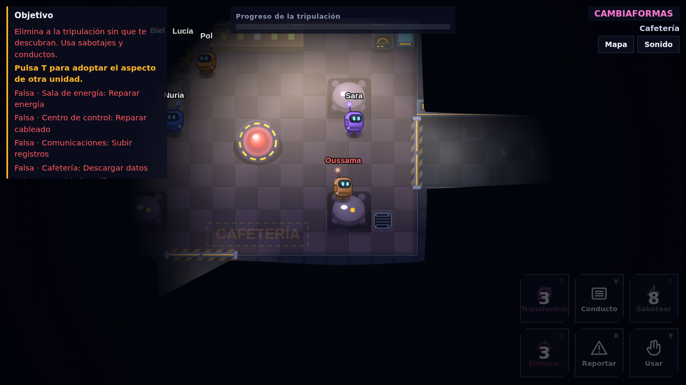
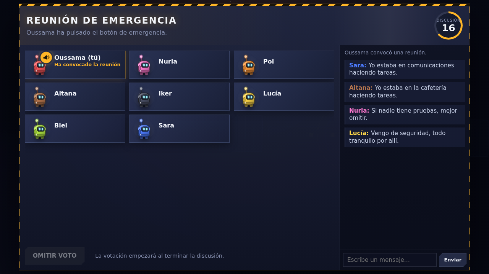
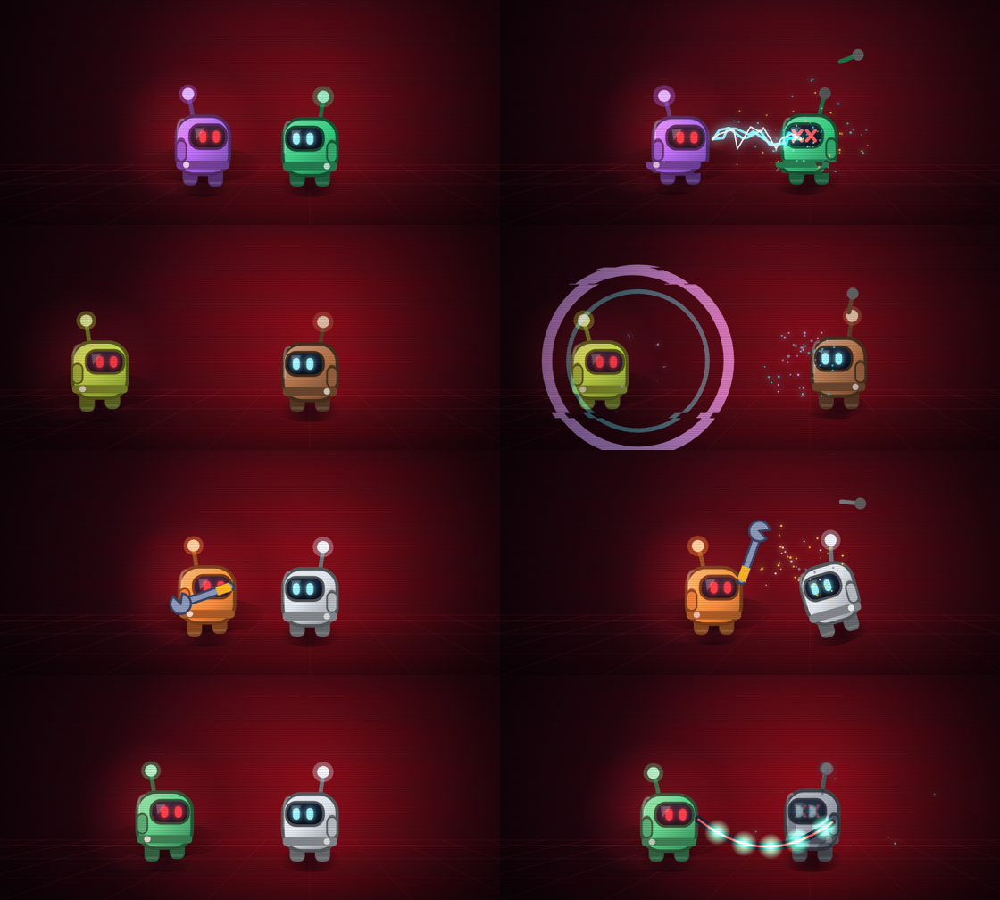
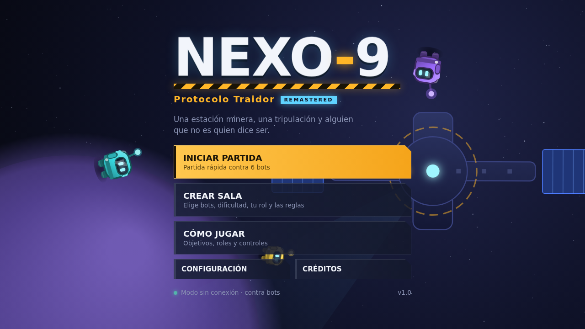
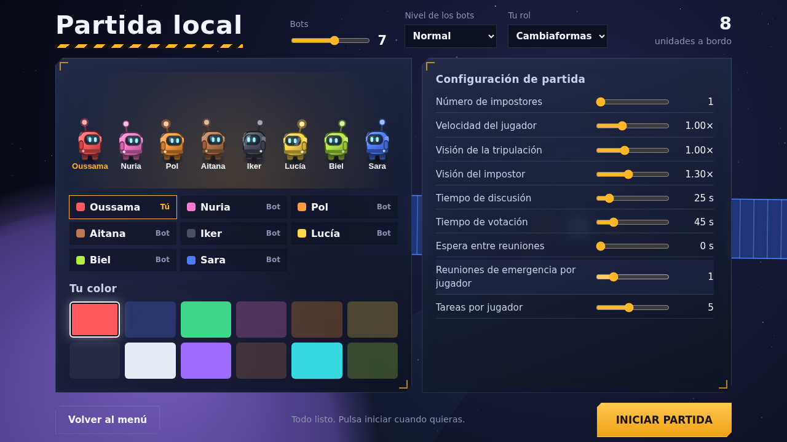
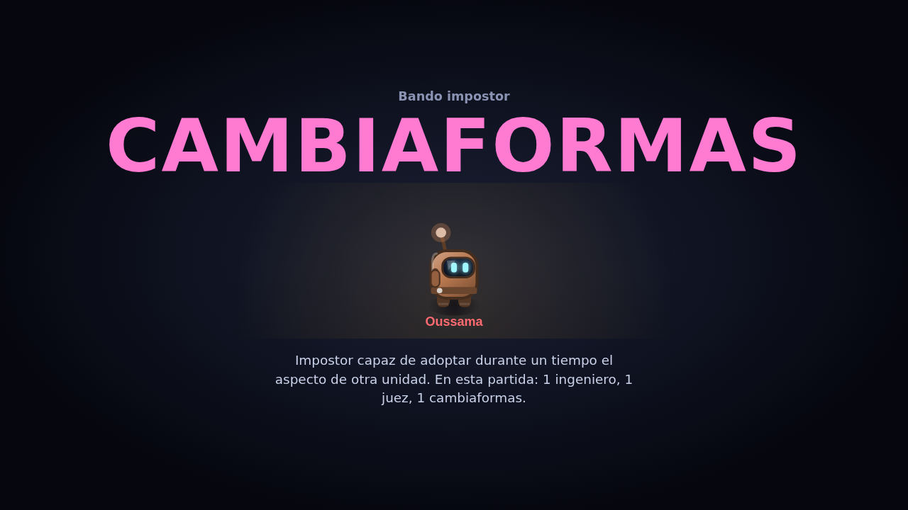

# NEXO-9 · Protocolo Traidor — REMASTERED

Juego de deducción social para navegador. Una estación minera, una tripulación de robots y uno o más traidores entre ellos.

**[▶ Jugar ahora](https://ossama450298-commits.github.io/Nexo9/)** · Funciona en ordenador, portátil y tablet. No hace falta instalar nada.

## Novedades de REMASTERED

Remasterización visual completa con la misma jugabilidad de siempre:

- **Mapa con volumen:** paredes biseladas con remaches, tuberías, monitores y franjas de peligro; suelos con textura, manchas y cables; luz empotrada en los pasillos.
- **Iluminación cinematográfica:** conos de luz bajo cada foco y un tono distinto según la situación (frío industrial, apagón con balizas, emergencia en rojo, comunicaciones caídas).
- **Personajes más vivos:** se inclinan al caminar, levantan polvo, llevan hombreras y un reflejo que recorre la visera.
- **Interfaz nueva:** paneles de cristal, botones con estados claros, HUD con barra segmentada, reuniones con temporizador en anillo, cámaras con visor de vigilancia y mapa táctico con barrido.
- **Momentos clave:** expulsión con planeta y estela, y finales con destellos de victoria o brasas de derrota.
- **Más rápido que antes:** la iluminación va grabada en el mapa, así que cada fotograma se dibuja más deprisa que en la versión anterior.

## Cómo jugar

Abre el enlace de arriba o descarga `index.html` y ábrelo con doble clic: funciona incluso sin Internet.

- **INICIAR PARTIDA** empieza al momento contra 6 bots.
- **CREAR SALA** abre el lobby: eliges cuántos bots (2–11), su nivel, tu rol y todas las reglas.

Si eres **tripulante**, completa tus tareas y descubre a los impostores. Si eres **impostor**, elimina a la tripulación sin que te descubran.

## Roles

| Rol | Bando | Habilidad |
|---|---|---|
| Tripulante | Tripulación | Tareas, reportar cuerpos, reuniones y voto. |
| Ingeniero | Tripulación | Viaja por los conductos durante un tiempo limitado. |
| Juez | Tripulación | Tras sus tareas, la Anulación expulsa a quien elija. Si se equivoca, sale él. |
| Impostor | Impostores | Elimina, sabotea y usa conductos. |
| Cambiaformas | Impostores | Adopta durante un tiempo el aspecto de otra unidad. |

## Qué incluye

- **Estación original de 10 salas** con puertas automáticas, conductos, cámaras de seguridad e iluminación dinámica.
- **6 minijuegos de tareas** con tres niveles de dificultad.
- **3 sabotajes:** fallo eléctrico, caída de comunicaciones y emergencia energética.
- **Reuniones** con megáfono para quien convoca, chat, votación y expulsión.
- **Bots con deducción:** recuerdan dónde vio cada uno a quién, comprueban coartadas, desmienten mentiras y se acusan en el chat. Los impostores acechan, apagan las luces y se cubren entre ellos.
- **4 escenas de eliminación** que salen al azar: descarga eléctrica, pulso EMP, llave inglesa y drenaje de energía. Las ves tanto si te eliminan como si eliminas tú (como impostor; se puede desactivar en Configuración).
- **Sonido y música** sintetizados en el navegador.

## Controles

| Tecla | Acción |
|---|---|
| WASD / Flechas | Moverse |
| E / Espacio | Usar, tareas, botón de emergencia, cámaras |
| R | Reportar cuerpo |
| Q | Eliminar (impostor) |
| F | Sabotear (impostor) |
| V | Conducto (impostor e ingeniero) |
| T | Transformarse (cambiaformas) |
| M · Tab | Mapa · Lista de tareas |
| Esc | Cierra ventanas o abre el **menú de pausa** (reanudar, audio, opciones, controles y salir). Contra bots, la partida se detiene. |

En pantallas táctiles aparece un joystick y los botones se pulsan con el dedo.

## Más capturas

| Menú | Lobby | Revelación del rol |
|---|---|---|
|  |  |  |

---

Juego original. Personajes, mapa, interfaz, efectos y música generados por código, sin recursos de terceros. Inspirado en el género de deducción social.
